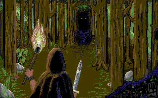
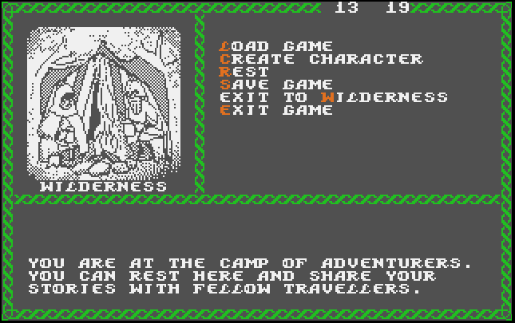

# TheThingOfABadThing
Pseudo-3D game engine and tools to create games in BASIC65 on the Mega65 computer.
The title comes from the joke that Fighting-Fantasy gamebooks follow the "thing of a bad thing" title pattern :)
The writer of this work is not a skilled coder; so, any ideas to improve this software would be appreciated.

This project aims to provide an "engine" and some tools to create 3D-looking role playing games (similar to the Bard's Tale series for example) in BASIC 65.
The project is not completed yet, it is in a WIP state.

## The engine (first version):
  You can generate a character which has Strength, Attack and Defense attributes.
  The player can see the environment in a 12x12 "3D"-like first-person view, which is displayed using custom character graphics (144 characters which's values are copied from the Attic RAM when modified).
  The player can roam in a 20x20 map where he can meet monsters (probability and monster level is set by the variables associated with the actual level).
 Some NPCs and quests are added in the subroutine that handles "special" cells.

## The tools:
  ### IFFTOTILE:
  This tool allows to convert the graphics of the walls from an IFF file to character data in a specific order, and copies it to the Attic RAM from where it can be saved to disk for the main program to reach.
  ### IFFTOBGND:
  It is a variation of the IFFTOTILE but only saves a smaller segment (144 characters) of an IFF file which can be used as a background (ground and sky for example).
  ### NEWMAPEDIT:
  This is the new, improved version of the mapeditor tool.

## The MAP:
  The map file contains the grid data of 20x20 Front and Side values (walls facing to the player and walls facing to the right) and if the cell is "special" (can trigger custom events) in the following order: (FR1,1, SI1,1, SP1,1, FR1,2, SI1,2, SP1,2, FR1,3...., FR20,20, SI20,20, SP20,20)

      SI0,0    SI1,0    SI2,0
      |        |        |
      --FR0,0-----FR0,1---
      |        |        |
      SI1,0   SI1,1    SI1,2
      |        |        |
      --FR0,1-----FR1,1---

## How to make a game with it?
  - Draw some wall graphics and import them with the IFFTOTILE tool to different Attic RAM "slots". Save these slots to disk (There is a line at the end of the program REM-ed out for this, saves all the slots in one file: uncomment and execute this line directly after you have imported sevaral pictures to the desired slots).
  - Draw a background (sky and ground of the level) and import and save it with IFFTOBGND.
  - Create a map. You can use the MAPEDIT tool for it, but the current version only contains a few wall variations so it could be updated with more.
  - There is an other array which indicates if a cell is "Special": if the main program detects that the actual cell is "Special" it forks to evaulate and process it.
  - Create the dialogs / story / quests in the main loop of the program using BASIC.
  - Objects are stored in DATA statements with indication if they are equipable or useable and if they give bonuses to the player stats
    
## Plans for the future:
  - More wall types: city walls, dungeon walls etc.
  - It would be nice to change the monochrome character mode to NCM (nibble colour mode) to have more colours once I learn how to do it, but at the moment the main priority is to complete the engine to have something playable.
  - NPC-s / shops and other special locations
  - Moving between different MAPs.
  - Load / Save functions
  
